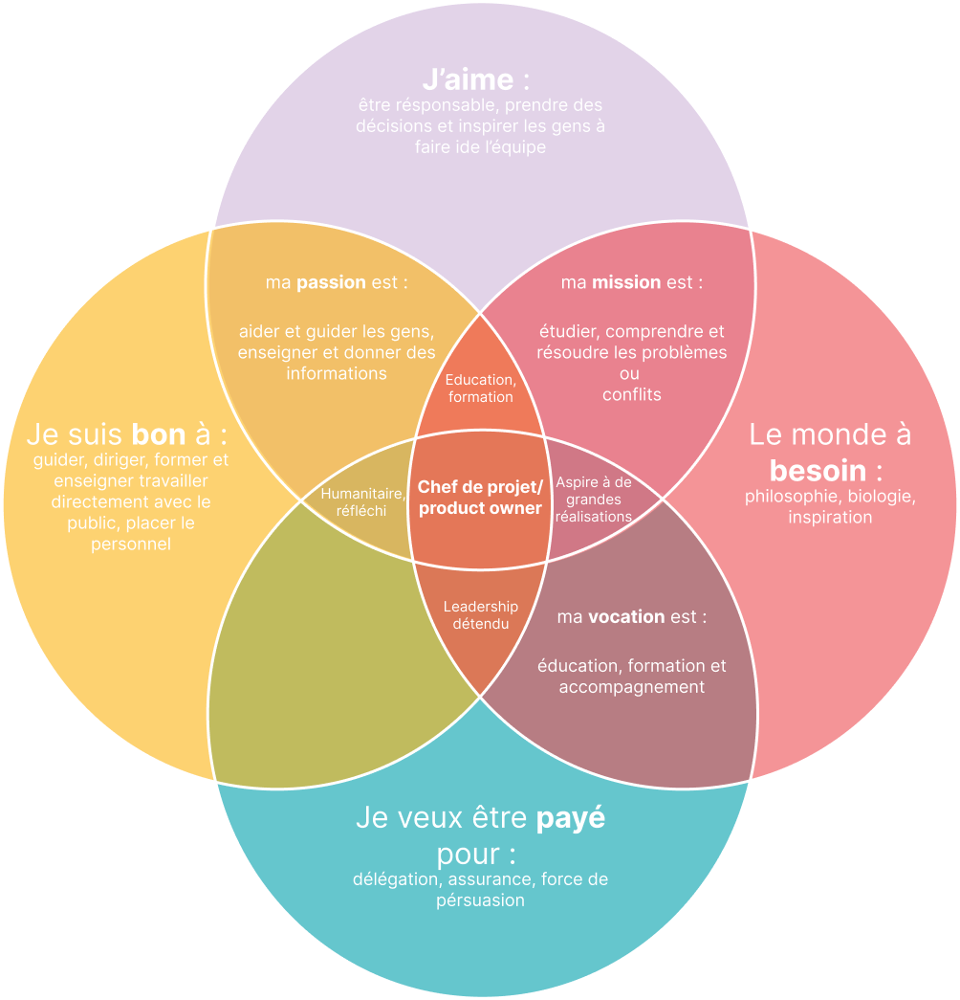

+++
title = "À propos"
date = "2022-12-12"
aliases = ["about-us","about-hugo","contact"]
[ author ]
  name = "Hugo Authors"
+++

Bonjour, je m'appelle Stéphane Sordet. Je suis actuellement en dernière année d'études en Ingénieur des Médias.

Ce petit blog a été créé dans le cadre d'un cours de veille technologique. Il me permet d'échanger sur les métiers du management dans le digital qui m'intéressent particulièrement, notamment en tant que product manager/owner.

Je suis passionné par les nouvelles technologies et les tendances du marché, et j'espère partager mes découvertes et mes réflexions avec vous à travers ce blog.

Merci de votre visite !

## Mon ikigai 

## Ma fiche de domaine 

### Product manager/owner 

**Domaine** : développement sites web, applications,  refonte, branding 

**Mots-clés** : stratégie digitale, projets digitaux, leadership, gestion et management 

**Sous-domaines** : prise de parole, présentation, conversion et “manipulation”

**Pourquoi ?** : j’aime travailler en groupe et prendre des décisions. Discuter et argumenter pour arriver au meilleur résultat. Je veux pouvoir compter sur les gens et inverssement. 
